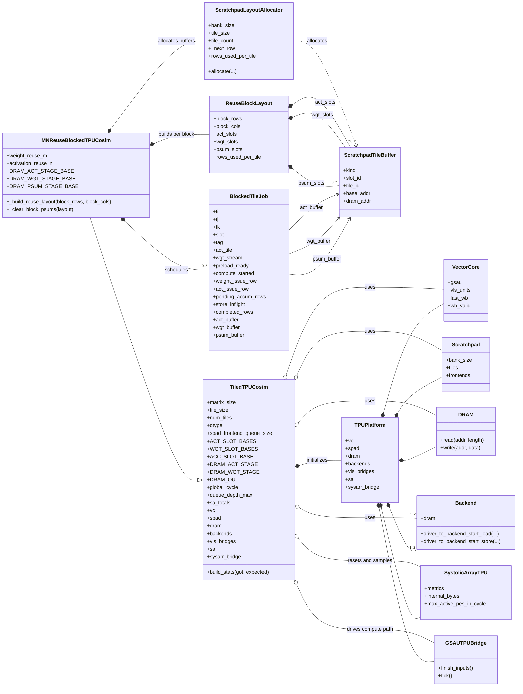

# SysArr TPU Platform

For the clocking and scheduling machinery underneath all of this, see
[base-classes.md](base-classes.md).

## Shape of the platform

The detailed figures below are Mermaid, which renders on GitHub but is hard to
read as source. Here is the same structure in plain text — the tick order is
top to bottom, and the arrows are `SimQueue` FIFOs.

```
   phase 10   VectorCore ────────────────────────────────────────────┐
                │  scheduler builds VLIW packets                     │
                ├──► vliw_q ──► VLSU.issue_q ──► VLSU.req_q          │
                │              (+ load_dst_fifos: dst metadata)      │
                └──► gsau.to_systolic                                │
                     (+ gsau.rd_queue: awaited destinations)         │
                                                                     │
   phase 20   VLSFrontendBridge                                      │
                VLSU.req_q ──► Frontend.readq / .writeq              │
                                                                     │
   phase 30   GSAUTPUBridge                                          │
                gsau.to_systolic ──► SystolicArrayTPU                │
                  ├─ enqueue_weights ──► _weight_boundary[g]         │
                  ├─ enqueue        ──► _input_fifo_left[g]          │
                  ├─ enqueue_psums  ──► _psum_input_fifo_top[j]      │
                  └─ psum_output_fifo_bottom ──► gsau.from_systolic ─┤
                                                                     │
   phase 40   Scratchpad                                             │
                Frontend.readq  ──► tile_read_xbars[t]  ──► banks    │
                Frontend.writeq ──► tile_write_xbars[t] ──► banks    │
                banks ──► (callback) ──► frontend cb ──► VLSU rsp    │
                                                                     │
   phase 50   Backend ──► DRAM burst channel ──► Scratchpad          │
                                                                     │
   phase 90   Harness  ◄────── wb_valid / last_wb ────────────────────┘
                observes writeback, issues the next work,
                stops the clock when the run completes
```

Two properties this picture is meant to make obvious:

- **Groups tick in the direction data flows.** Inside the scratchpad the order
  is frontends, then crossbars, then banks — so work handed downstream is
  picked up in the same cycle, exactly as it was before idle components were
  skipped.
- **Every arrow is a bounded FIFO.** A full queue is how a stall is expressed;
  no component asks another whether it is busy.

---

This note combines two further views of the sysarr TPU simulator stack:

- a detailed runtime flowchart focused on modeled dataflow, queue ownership, and per-cycle driving
- a class-style view of the tiled and blocked harness layer that builds and drives the platform

The runtime figure is intentionally larger and more detailed than the older UML-only version.
It is meant to be readable as a full-page architecture figure, so it includes the high-value
queues and FIFOs that usually explain stalls, overlap, and backpressure in the simulator.

## Runtime Platform Flowchart

This flowchart is queue-centric rather than class-centric. It shows:

- what the harness drives each cycle
- how the scheduler packetizes work and issues it into VLSU, GSAU, and datapath paths
- where scratchpad, backend, and TPU boundary queues sit in the modeled path
- where metadata-only FIFOs such as destination queues are paired with returning data

```mermaid
flowchart LR
  subgraph H["Harness / Experiment Driver"]
    direction TB
    H0["TiledTPUCosim / MNReuseBlockedTPUCosim"]
    H1["Work decomposition<br/>output tile or blocked output block<br/>jobs tagged by (ti, tj, tk)"]
    H2["Driver responsibilities<br/>prefetch operands, launch kernels,<br/>drain psums, sample metrics"]
    H3["Per-cycle _step()<br/>vc.tick() -> vls bridges.tick() -> sysarr_bridge.tick()<br/>backend.tick() -> spad.tick()"]
    H4["Completion checks<br/>row completion, inflight counters,<br/>compute_path_idle(), drain complete"]
    H0 --> H1 --> H2 --> H3 --> H4
  end

  subgraph S["Vector Core Scheduler / Front End"]
    direction TB
    S0["Scheduler API<br/>enqueue_memory()<br/>enqueue_gsau()<br/>enqueue_datapath()"]
    S1["Build packet slots<br/>_build_packet['vlsu']<br/>_build_packet['gsau']<br/>_build_packet['datapath']"]
    S2["vliw_q<br/>packet queue of built VLIW entries"]
    S3["Per-cycle issue logic<br/>partial issue allowed under backpressure"]
    S0 --> S1 --> S2 --> S3
  end

  subgraph RF["Architectural Vector State"]
    direction TB
    R0["Veggie<br/>vector register file and dtype state"]
    W0["wb_buffer<br/>shared architectural writeback sink"]
    W1["wb_valid / last_wb<br/>architectural completion visible to harness"]
    W0 --> R0
    W0 --> W1
  end

  subgraph VLS["VLSU / Scratchpad Frontend Path"]
    direction TB
    V0["VLSU.issue_q"]
    V1["VLSU.req_q"]
    V2["VLSU.load_dst_fifos[spad]<br/>destination metadata FIFO"]
    V3["VLSFrontendBridge"]
    V4["Frontend.readq"]
    V5["Frontend.writeq"]
    V6["tile_read_xbars[tid]._pending"]
    V7["tile_write_xbars[tid]._pending"]
    V8["tile.banks[bank]._pending"]
    V9["VLSU.rsp_q"]
    V10["VLSU.wb_q"]
    V0 --> V1 --> V3
    V3 -->|load request| V4 --> V6 --> V8
    V3 -->|store request| V5 --> V7 --> V8
    V8 -->|load data| V3
    V3 --> V9 --> V10 --> W0
    V2 -. metadata match .-> V9
  end

  subgraph DP["Vector Datapath Path"]
    direction TB
    D0["datapath.pending_issue"]
    D1["laneX.&lt;fu&gt;.entries<br/>in-flight lane operations"]
    D2["laneX.&lt;fu&gt;.completed"]
    D3["laneX.meta_fifo[fu]<br/>per-element metadata"]
    D4["laneX.pending_outputs"]
    D5["collector.pending_reductions"]
    D6["collector.completed_vectors"]
    D0 --> D1 --> D2 --> D4
    D4 --> D6 --> W0
    D4 --> D5 --> D6
    D3 -. metadata pairing .-> D2
  end

  subgraph G["GSAU / TPU Compute Path"]
    direction TB
    G0["GSAU.to_systolic"]
    G1["GSAUTPUBridge<br/>_pending_meta<br/>finish_inputs()"]
    G2["tpu._weight_boundary[g]"]
    G3["tpu._input_fifo_left[g]"]
    G4["tpu._input_algo_flags<br/>algorithmic bookkeeping FIFO"]
    G5["tpu._psum_input_fifo_top[j]<br/>zero or psum seed FIFO"]
    G6["SystolicArrayTPU array"]
    G7["GSAU.from_systolic"]
    G8["GSAU.rd_queue<br/>destination metadata FIFO"]
    G9["GSAU.writebacks"]
    G0 --> G1
    G1 -->|weight groups| G2 --> G6
    G1 -->|activation groups| G3 --> G6
    G1 -->|algo flags| G4
    G5 --> G6
    G6 -->|output rows| G1 --> G7 --> G9 --> W0
    G8 -. metadata match .-> G7
  end

  subgraph B["Backend / DRAM Staging Path"]
    direction TB
    B0["driver_to_backend_start_load() / store()<br/>harness SDMA requests"]
    B1["backend._tx_queue"]
    B2["backend._dram_pending<br/>in-flight burst queue"]
    B3["backend._pending_sram_reads<br/>storeback row staging"]
    B4["DRAM"]
    B0 --> B1 --> B2
    B2 -->|burst read / write| B4
    B4 -->|load burst data| B2
    B2 -->|preload writes into scratchpad| V7
    B1 -->|storeback reads from scratchpad| V6
    V8 -->|row data for store tx| B3 --> B2
  end

  subgraph L["Legend"]
    direction TB
    L0["Green nodes = queues exported in queue_max_depths / queue_avg_depths"]
    L1["Amber nodes = additional internal queues or FIFOs that often explain stalls"]
    L2["Solid arrow = payload, transaction, or returned data flow"]
    L3["Dashed arrow = metadata or control pairing path"]
  end

  H2 -->|inject ops into platform| S0
  H2 -->|launch preload or drain tx| B0
  H3 -. advances each cycle .-> S3
  H3 -. ticks bridge .-> V3
  H3 -. ticks bridge .-> G1
  H3 -. ticks backend .-> B2
  H3 -. ticks scratchpad .-> V8

  R0 -. register reads at issue .-> S3
  S3 --> V0
  S3 --> D0
  S3 --> G0
  S3 -. load destination metadata .-> V2
  S3 -. expect_output metadata .-> G8

  classDef driver fill:#f3ebff,stroke:#6f42c1,stroke-width:1.2px;
  classDef block fill:#edf3ff,stroke:#345995,stroke-width:1.2px;
  classDef qstat fill:#e4f4e5,stroke:#2f7d32,stroke-width:1.4px;
  classDef qextra fill:#fff1d6,stroke:#9a6700,stroke-width:1.4px;
  classDef note fill:#f8f8f8,stroke:#777777,stroke-width:1px;

  class H0,H1,H2,H3,H4 driver;
  class S0,S3,R0,W1,G1,B0,B4 block;
  class S1,S2,W0,V0,V1,V2,V9,V10,G0,G7,G8,G9 qstat;
  class V4,V5,V6,V7,V8,D0,D1,D2,D3,D4,D5,D6,G2,G3,G4,G5,B1,B2,B3 qextra;
  class L0,L1,L2,L3 note;
```



## Tiled And Blocked Harness

This diagram highlights the state that matters most when reading the blocked
experiments: harness configuration, scratchpad buffer allocation, and the
mutable per-job bookkeeping that drives preload, compute, accumulation, and
storeback.



## Entry Points

The main assembly functions are:

- `build_tpu_platform(...)` in [src/atalla/sysarr_tpu_system.py](../../src/atalla/sysarr_tpu_system.py)
- `build_tpu_compute_path(...)` in [src/atalla/sysarr_tpu_system.py](../../src/atalla/sysarr_tpu_system.py)

The main user-facing wrappers are:

- `SysArrTPUSystem` in [src/atalla/sysarr_tpu_system.py](../../src/atalla/sysarr_tpu_system.py)
- `TiledTPUCosim` in [tests/atalla/test_scratchpad_vector_core_sysarr_tpu_tiled_1024.py](../../tests/atalla/test_scratchpad_vector_core_sysarr_tpu_tiled_1024.py)
- `MNReuseBlockedTPUCosim` in [tests/atalla/test_scratchpad_vector_core_sysarr_tpu_tiled_1024_blocked_mn.py](../../tests/atalla/test_scratchpad_vector_core_sysarr_tpu_tiled_1024_blocked_mn.py)

## Reading Guide

- `VectorCore` is the control shell that owns the vector datapath, register file,
  VLS units, and GSAU.
- `Scratchpad` plus `Frontend`, `Xbar`, `SRAMBanks`, `Backend`, and `DRAM` form
  the memory system.
- `GSAUTPUBridge` and `VLSFrontendBridge` connect the vector core to the TPU and
  scratchpad paths.
- `TiledTPUCosim` and `MNReuseBlockedTPUCosim` sit above the platform and define
  the execution policy used by the experiments and sweeps.