# Old vs new architecture, 1024x1024

Four runs of the same 1024x1024 GEMM. The harness is the control — identical
decomposition, tile scheduling and reuse policy — so the only difference is the
hardware:

| | old | new |
|---|---|---|
| systolic array | TPU, grouped MAC + 4-input adder | MEISSA, multiplier grid + column adder trees |
| scratchpad | 2 pads x 1 MB | 4 pads x 0.5 MB (same 2 MB) |
| prefetch slots | 2 | 4 |
| VLSUs reached | 2 | 4 |

## Headline

| harness | old | new | delta |
|---|---|---|---|
| tiled, no reuse | 22,019,204 | 21,848,064 | **−0.8%** |
| blocked M/N, weight + activation reuse | 13,250,546 | 11,626,041 | **−12.3%** |

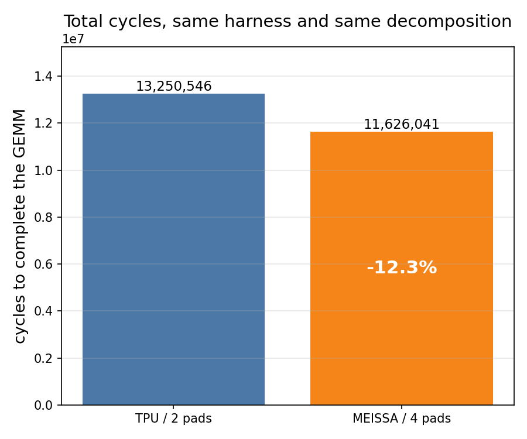

## The result that explains everything else

Every one of the **32,768 tile-pair kernels** got faster, and by a lot — median
**−27.7%**, clustered into four discrete buckets (one per position in the reuse
block).

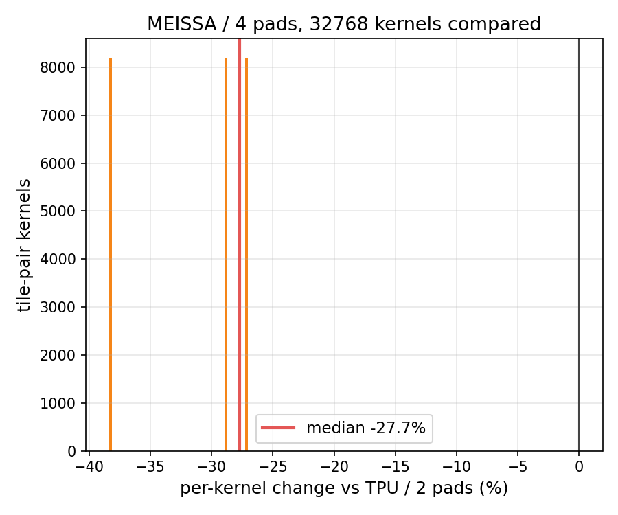

But the GEMM only improved 12.3%. The gap is the point:

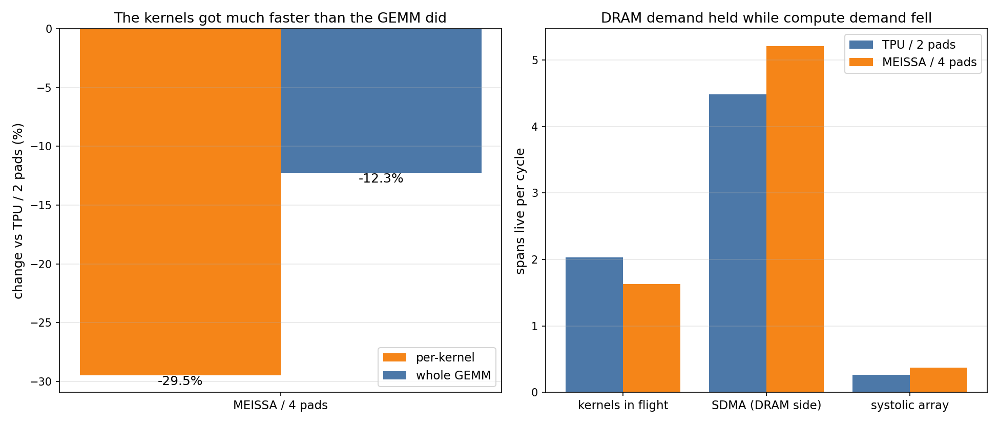

| | tiled old | tiled new | blocked old | blocked new |
|---|---|---|---|---|
| mean kernel | 1323.5 | 1313.2 | 820.8 | **579.0** |
| kernels live per cycle | 1.97 | 1.97 | 2.03 | 1.63 |
| SDMA spans live per cycle | 2.67 | 2.70 | 4.49 | **5.21** |
| systolic array live per cycle | 0.16 | 0.16 | 0.26 | 0.37 |

The compute side sped up ~30%; the DRAM side did not move, because it cannot.
One `SharedDRAMBurstChannel` allows one burst launch per cycle across every
backend, so aggregate DRAM bandwidth is fixed no matter how many pads there
are — that was a deliberate invariant, and this is it being paid for. SDMA
spans get *longer* (5.21 live per cycle, up from 4.49) because more of them
queue behind the same channel.

**The channel is not saturated, though.** Measured from the traffic, it
launches a burst on 51.4% of cycles in the old run and 58.6% in the new one —
rising, and the largest single resource, but with headroom. What actually
caps the gain is that the DRAM *fill* is a near-fixed ~900-cycle prefix on
every reuse block (see the Gantt below), set by transfer size, burst rate and
queueing. The design shortens the tail behind that prefix; it cannot shorten
the prefix.

**Reuse is what decides whether the new architecture is worth anything.**
Without it the plain tiled harness reloads every tile pair, is entirely
DRAM-bound, and the mean kernel barely moves (1323.5 → 1313.2). Cut the DRAM
traffic with weight and activation reuse and the same hardware change is worth
12.3%.

## Seeing it on the reuse timeline

One weight-reuse block — four kernels sharing a resident weight tile. Both
panels start at zero and are drawn to the same scale.

Old, 2,292 cycles:

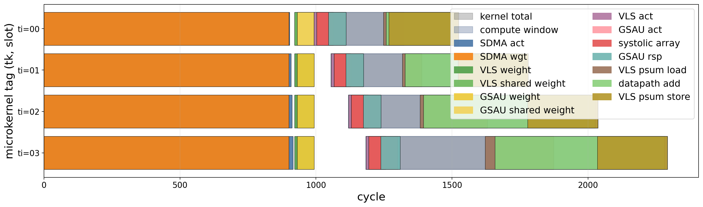

New, 2,099 cycles:

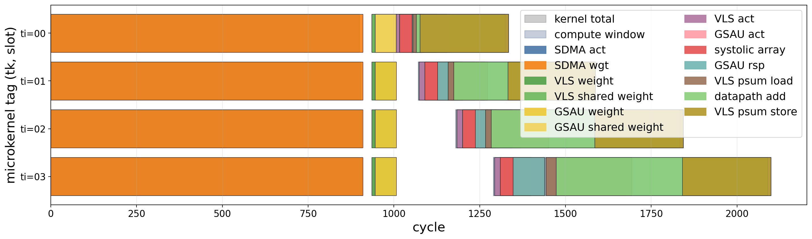

The orange `SDMA wgt` prefix is 900 and 910 cycles — about 40% of the
block, and completely unchanged. What shrinks is the tail: the compute window
narrows and the `systolic array` and `GSAU rsp` bands pull in behind it. That
is the 12.3%, and it is also why there is not more of it.

## Where the time goes

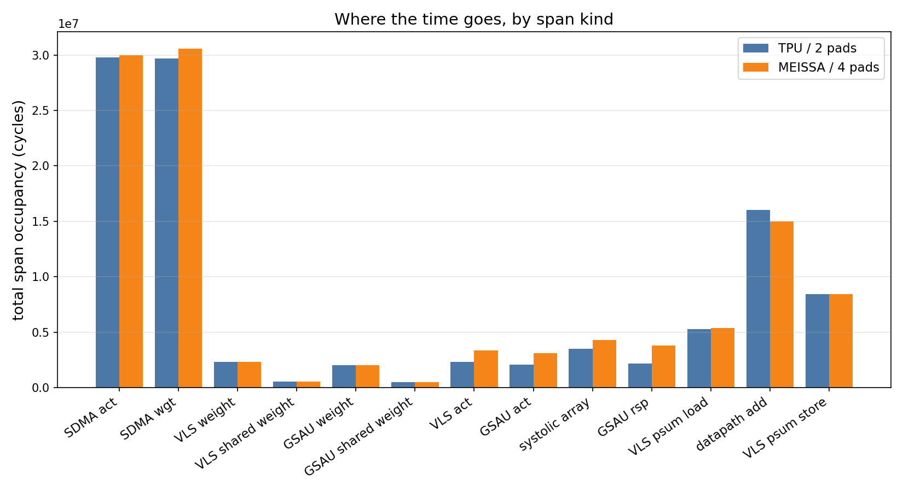

Span occupancies overlap, so these are not a partition of the runtime. Most
kinds are flat or slightly *higher* on the new architecture while wall time
falls — which is what more concurrency looks like. The one that genuinely
shrinks is `datapath add` (16.0M → 15.0M), the vector core's accumulate, which
now runs on four VLSUs and the operand collector.

## Two designs x two schedules

The four runs together show something neither axis shows alone.

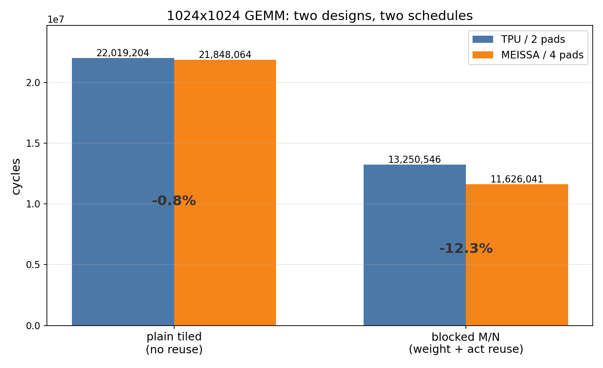

**The lines are not parallel, which is the whole point.** The design is worth
1.62M cycles with reuse and 0.17M without — a 10x difference in what the same
hardware change buys, decided entirely by the software schedule.

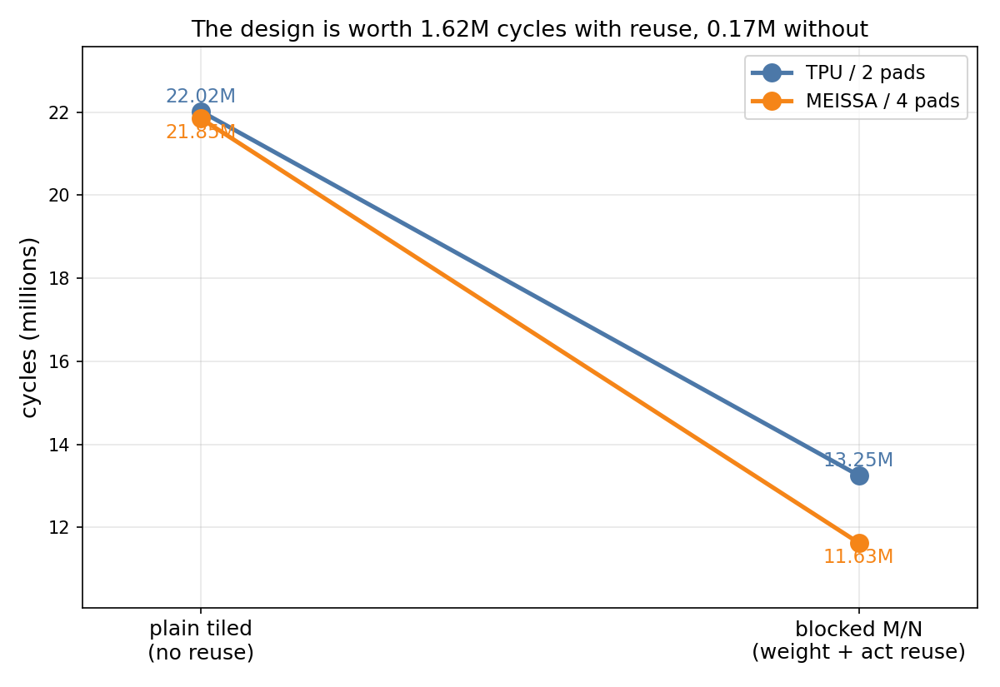

Applying the two changes in either order reaches the same 11.63M, but the
credit splits completely differently:

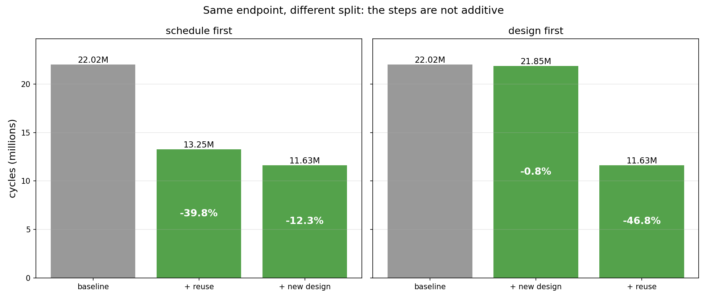

| order | first step | second step |
|---|---|---|
| schedule first | reuse **−39.8%** | design **−12.3%** |
| design first | design **−0.8%** | reuse **−46.8%** |

Quote either number for the design and you would be telling the truth and
misleading the reader. It is worth −0.8% or −12.3% depending on what it is
measured against.

### DRAM: traffic belongs to the schedule

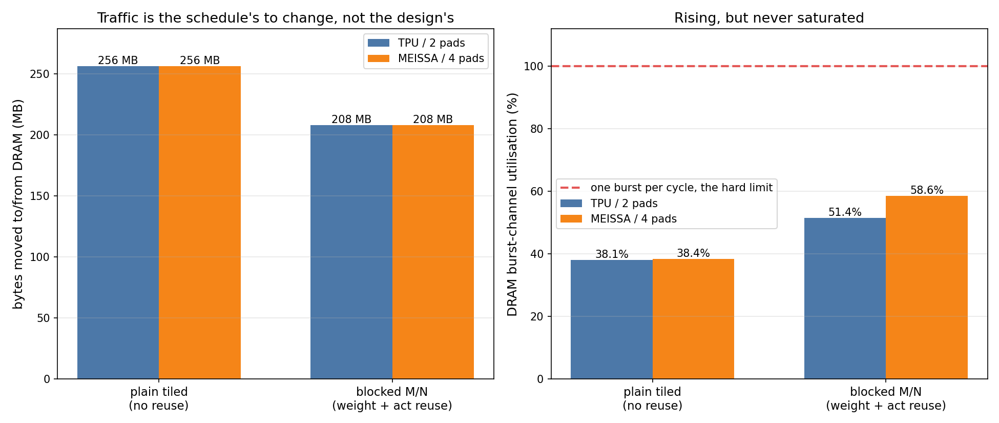

Traffic is byte-identical between designs within a schedule — 256 MB tiled,
208 MB with reuse — because the decomposition is the same and only the
schedule changes what gets reloaded. The design cannot touch it.

The right panel is the resource more pads genuinely cannot widen. Utilisation
climbs 38.1% → 38.4% → 51.4% → **58.6%**: rising, the largest single
consumer, and still with headroom. This is what corrected an earlier claim of
mine that the runs were DRAM-saturated — they are not.

### The control

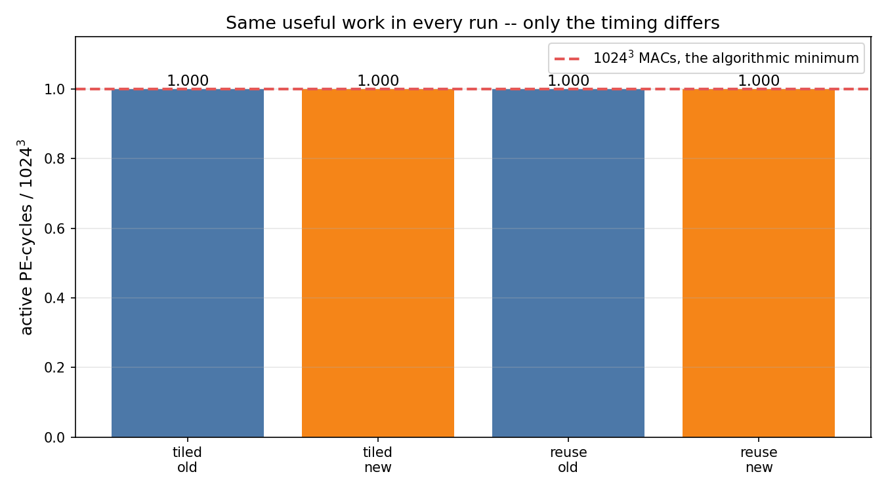

`active_pe_sum` is exactly 1024³ in all four runs: the same useful MACs, only
scheduled differently. That is what makes cycles and bytes comparable.

### Per-kernel distribution

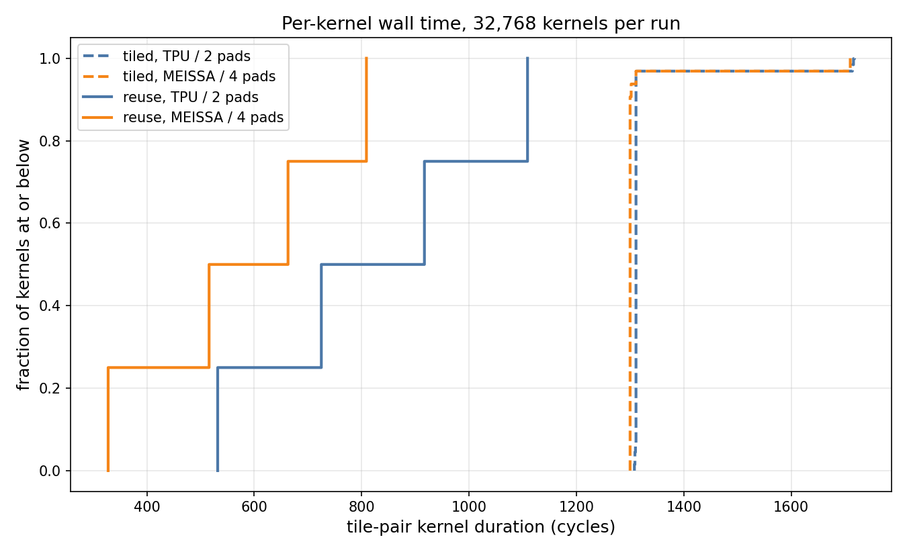

The dashed pair (tiled) sit on top of each other — with no reuse the design
changes nothing about how long a kernel takes. The solid pair (reuse) separate
into four clean steps, one per position in the reuse block, with MEISSA left of
the TPU at every quantile.

### One thing these graphs deliberately omit

`pe_mac_ops`, `pe_mul_ops`, `pe_add_ops`, `flops_micro`, `mac_utilization` and
the average-active-PE figures are **not comparable across designs**. The two
arrays count them by different conventions: the TPU counts every cell it
clocks, bubbles included (2.375x the true MAC count on the tiled run), while
MEISSA counts only live columns (1.000x). A bar chart of those would show a
difference in bookkeeping, not in hardware, so nothing here plots them.

## Regenerating

```bash
PYTHONPATH=src:. python tools/plot_arch_comparison.py --runs logs/blocked1024_tpu_2pad logs/blocked1024_meissa_4pad --out docs/results/arch-comparison
```

```bash
PYTHONPATH=src:. python tools/plot_arch_comparison.py --runs logs/tiled1024_tpu_2pad logs/tiled1024_meissa_4pad --out docs/results/arch-comparison/tiled
```

And the 2x2:

```bash
PYTHONPATH=src:. python tools/plot_design_schedule_matrix.py --tiled-old logs/tiled1024_tpu_2pad --tiled-new logs/tiled1024_meissa_4pad --reuse-old logs/blocked1024_tpu_2pad --reuse-new logs/blocked1024_meissa_4pad --out docs/results/arch-comparison/matrix
```

The first `--runs` entry is the baseline; more than two can be passed. See
[harnesses/arch-comparison.md](../harnesses/arch-comparison.md) for the
commands that produced the logs.

### A note on the reuse Gantt

A per-span Gantt of the whole GEMM is useless at this scale — an 800-cycle span
on an 11M-cycle axis is one pixel, which is why the harness's own
`kernel_gantt_weight_reuse_*.png` at 1024 shows only tick marks. The comparison
tool zooms to the first *contiguous* block instead: the earliest tag plus every
tag that starts before the last of them ends. Filtering on `(tj, tk)` alone
does not do this, because the same weight column is revisited in every reuse
block, millions of cycles apart.
