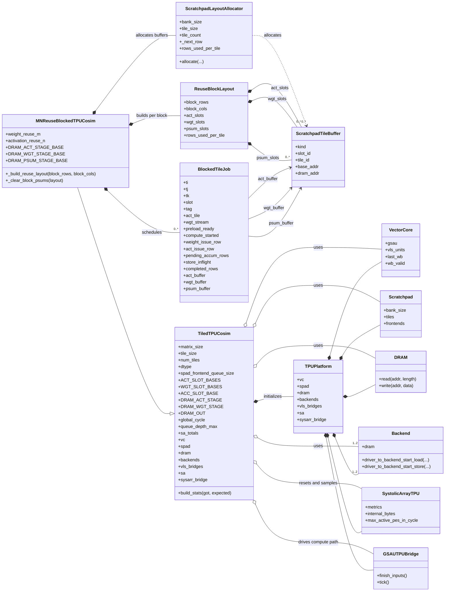

# SysArr TPU System UML

This note provides a high-level UML class view of the current sysarr TPU stack.
To keep the diagram readable, the system is split into two class diagrams:

- the runtime platform and data-path objects
- the tiled and blocked harness layer that drives the platform

The diagrams are intentionally high-level. They include the classes that define
the end-to-end simulator structure, but omit small helper structs and most
internal utility classes.

  ## Runtime Platform

  This diagram keeps only the state that is most useful when reading the runtime:
  queue ownership, platform assembly, scratchpad/memory plumbing, and the main
  simulation entrypoints. `Clocked.tick(time)` is shown explicitly so the
  clock-driven objects are easy to identify.

  ```mermaid
  classDiagram
    direction LR

    class Clocked {
      +tick(time)
    }

    class SysArrTPUSystem {
      +size
      +dtype
      +vc
      +spad
      +sa
      +dram
      +backend
      +vls_bridge
      +sysarr_bridge
      +metrics
      +load_inputs(act, wgt_stream)
      +run(max_cycles)
    }

    class TPUPlatform {
      +eq
      +clk
      +sim
      +vc
      +spad
      +sa
      +dram
      +backends
      +vls_bridges
      +sysarr_bridge
    }

    class VectorCore {
      +dtype_default
      +vector_len
      +veggie
      +datapath
      +gsau
      +wb_buffer
      +vls_units
      +vliw_q
      +last_wb
      +wb_valid
    }

    class VectorDatapath {
      +vector_len
      +lane_count
      +issue_width
      +lanes
      +collector
      +pending_issue
      +last_result
    }

    class Veggie {
      +bank_count
      +regs_per_bank
      +data_banks
      +dtype_banks
      +conflict
    }

    class GSAU {
      +rd_queue_depth
      +to_systolic
      +from_systolic
      +rd_queue
      +writebacks
      +issue(cmd)
    }

    class VectorLoadStoreUnit {
      +issue_q
      +req_q
      +rsp_q
      +wb_q
      +load_dst_fifos
      +enqueue_issue(op)
    }

    class Scratchpad {
      +num_banks
      +bank_size
      +tiles
      +frontends
      +backends
      +tile_read_xbars
      +tile_write_xbars
      +attach_backend(backend, tile_id)
    }

    class Frontend {
      +tile_id
      +writeq
      +readq
      +write_stalled
      +read_stalled
      +read(base_sp_addr, row_idx, callback)
      +write(base_sp_addr, row_bytes, row_idx)
    }

    class Backend {
      +dram_latency
      +dram_q_depth
      +dram_burst_bytes
      +dram
      +_dram_pending
      +_tx_queue
      +_active_txs
      +driver_to_backend_start_load(...)
      +driver_to_backend_start_store(...)
    }

    class DRAM {
      +block_bytes
      +_blocks
      +read(addr, length)
      +write(addr, data)
    }

    class VLSFrontendBridge {
      +vc
      +spad
      +vls_id
      +frontend_id
      +bytes_load
      +bytes_store
      +activity_this_cycle
      +tick()
    }

    class GSAUTPUBridge {
      +vc
      +sa
      +mirror
      +_pending_meta
      +_flush_pending
      +_input_done
      +finish_inputs()
      +tick()
    }

    class SystolicArrayTPU {
      +size
      +group_size
      +num_groups
      +array
      +_input_fifo_left
      +_weight_boundary
      +_psum_input_fifo_top
      +metrics
      +internal_bytes
      +max_active_pes_in_cycle
      +set_control(...)
      +enqueue(activations)
      +enqueue_weights(weights)
    }

    Clocked <|-- VectorCore
    Clocked <|-- VectorDatapath
    Clocked <|-- GSAU
    Clocked <|-- VectorLoadStoreUnit
    Clocked <|-- Scratchpad
    Clocked <|-- Backend
    Clocked <|-- SystolicArrayTPU

    SysArrTPUSystem ..> TPUPlatform : builds via build_tpu_platform()
    TPUPlatform *-- VectorCore
    TPUPlatform *-- Scratchpad
    TPUPlatform *-- SystolicArrayTPU
    TPUPlatform *-- DRAM
    TPUPlatform *-- "1..*" VLSFrontendBridge
    TPUPlatform *-- "0..2" Backend
    TPUPlatform *-- GSAUTPUBridge

    VectorCore *-- VectorDatapath
    VectorCore *-- Veggie
    VectorCore *-- GSAU
    VectorCore *-- "1..*" VectorLoadStoreUnit
    Scratchpad *-- "2" Frontend
    Scratchpad o-- "0..2" Backend
    Backend --> DRAM
    VLSFrontendBridge --> VectorCore
    VLSFrontendBridge --> Scratchpad
    GSAUTPUBridge --> VectorCore
    GSAUTPUBridge --> SystolicArrayTPU
  ```

## Tiled And Blocked Harness

This diagram highlights the state that matters most when reading the blocked
experiments: harness configuration, scratchpad buffer allocation, and the
mutable per-job bookkeeping that drives preload, compute, accumulation, and
storeback.



## Entry Points

The main assembly functions are:

- `build_tpu_platform(...)` in [src/atalla/sysarr_tpu_system.py](../src/atalla/sysarr_tpu_system.py)
- `build_tpu_compute_path(...)` in [src/atalla/sysarr_tpu_system.py](../src/atalla/sysarr_tpu_system.py)

The main user-facing wrappers are:

- `SysArrTPUSystem` in [src/atalla/sysarr_tpu_system.py](../src/atalla/sysarr_tpu_system.py)
- `TiledTPUCosim` in [tests/atalla/test_scratchpad_vector_core_sysarr_tpu_tiled_1024.py](../tests/atalla/test_scratchpad_vector_core_sysarr_tpu_tiled_1024.py)
- `MNReuseBlockedTPUCosim` in [tests/atalla/test_scratchpad_vector_core_sysarr_tpu_tiled_1024_blocked_mn.py](../tests/atalla/test_scratchpad_vector_core_sysarr_tpu_tiled_1024_blocked_mn.py)

## Reading Guide

- `VectorCore` is the control shell that owns the vector datapath, register file,
  VLS units, and GSAU.
- `Scratchpad` plus `Frontend`, `Xbar`, `SRAMBanks`, `Backend`, and `DRAM` form
  the memory system.
- `GSAUTPUBridge` and `VLSFrontendBridge` connect the vector core to the TPU and
  scratchpad paths.
- `TiledTPUCosim` and `MNReuseBlockedTPUCosim` sit above the platform and define
  the execution policy used by the experiments and sweeps.